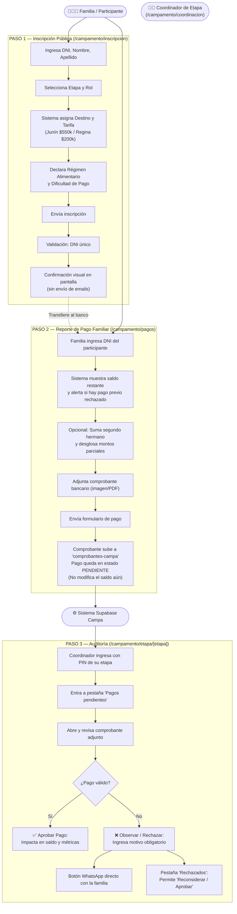

# Flujo Operativo y de Coordinación — Campamentos 2027

Este documento detalla el flujo de inscripción familiar, el circuito de reporte y auditoría de pagos, y la operatoria del panel de coordinación por etapa.

---

## 1. Diagrama del Circuito de Campamentos

---

## 2. Detalle de los Circuitos

### Circuito 1: Inscripción Pública (/campamento/inscripcion)
1. **Lectura y Condiciones:** La pantalla exhibe las fechas oficiales de campamento, cronograma de carga de camiones para Junín y Regina, y los datos bancarios del Santander con botones de copiado rápido (`GRUPOSDBNQN`).
2. **Carga de Datos:** La familia ingresa apellido, nombre y DNI (numérico, sin puntos).
3. **Asignación Automática:** Al elegir la etapa (1ra a 7ma), la interfaz calcula y muestra en tiempo real el destino y la tarifa plana.
4. **Validación de Unicidad:** Se ejecuta `inscribirParticipante`. Si el DNI ya existe, se rechaza la operación informando en pantalla. Si no existe, se inserta en `inscriptos`.
5. **Confirmación:** Muestra el resumen y recuerda guardar el comprobante de pago. No se envían correos electrónicos.

### Circuito 2: Reporte Familiar de Pagos (/campamento/pagos)
1. **Identificación y Consulta de Saldo:** La familia ingresa el DNI del participante. El sistema busca la ficha y presenta: Nombre, Etapa, Destino, Total ya abonado (solo pagos aprobados) y Saldo pendiente.
2. **Alerta de Pagos Rechazados:** Si el participante posee pagos observados previamente por coordinación, se destaca un recuadro de advertencia con la fecha y el motivo exacto del rechazo.
3. **Flujo de Hermanos:** La familia puede activar la opción de incluir a un hermano en la misma transferencia. Al ingresar el DNI del segundo hijo, se valida su ficha y se habilita un desglose de importes parciales (ej: \$100.000 para el hijo 1 y \$100.000 para el hijo 2).
4. **Subida y Persistencia:** Se adjunta el archivo (imagen o PDF hasta 10 MB) y teléfono de contacto. El Server Action `subirPagoFamilia` sube el archivo a Storage y crea los registros en `pagos` con `estado = 'PENDIENTE'` y `subido_por = 'FAMILIA'`. El saldo restante no se descuenta hasta que coordinación audite el comprobante.

### Circuito 3: Auditoría en el Portal de Coordinación
1. **Acceso por Etapa (`/campamento/coordinacion`):**
   - El coordinador selecciona su etapa (1 a 7).
   - Elige su nombre de la lista de chips existentes o ingresa un nombre nuevo (auto-registro en `coordinadores_etapa`).
   - Tipea el PIN de la etapa.
   - Si la etapa conserva el PIN default (`crv2027-e[X]`), se muestra un banner amarillo recomendando el cambio de contraseña desde el modal integrado.
2. **Pestaña Pagos Pendientes:**
   - Exhibe tarjetas con participante, DNI, monto informado, teléfono y enlace directo al archivo de comprobante.
   - **Aprobar:** Cambia el registro a `APROBADO`. En ese instante el monto se deduce del saldo restante del participante y se actualizan las métricas de recaudación de la etapa.
   - **Observar / Rechazar:** Abre un modal donde el coordinador escribe la causa del rechazo (ej: "No coincide el importe", "Comprobante ilegible"). El pago pasa a `RECHAZADO`.
   - **Contacto Directo:** Botón de WhatsApp con texto preconfigurado mencionando el participante y el motivo para contactar rápidamente a la familia.
3. **Pestaña Rechazados:**
   - Muestra el historial de pagos observados. Cuenta con la acción *"Reconsiderar / Aprobar"* para subsanar rechazos involuntarios.
4. **Carga Manual de Pagos:**
   - Desde el padrón de inscriptos, el coordinador puede presionar *"Gestionar Pagos"* sobre cualquier participante e ingresar pagos en efectivo o fuera de plataforma. Estos se registran inmediatamente como `APROBADO` con `subido_por = 'COORDINADOR'`.
