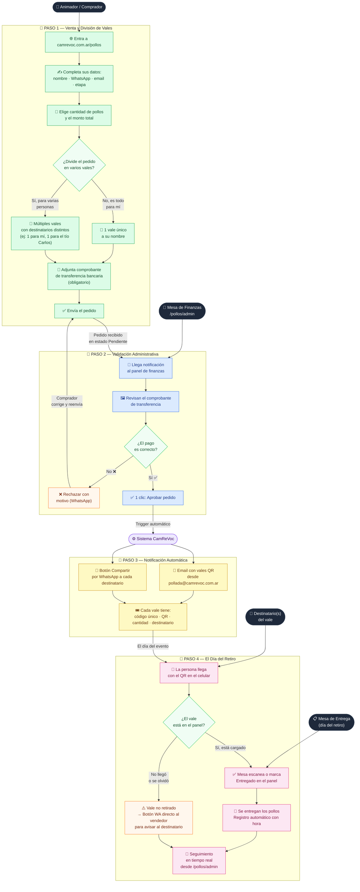

# 🐔 CamReVoc — Circuito completo de la Pollada Solidaria

> Guía visual para animadores, coordinadores y mesa de finanzas.
> Sin tecnicismos: esto es todo lo que necesitás saber para que el día del retiro salga redondo.

---

## Diagrama del circuito

---

## ¿Por qué este sistema? Los beneficios clave

### 📵 Cero planillas confusas de papel o Excel desactualizadas

Todos los datos viven en tiempo real en la nube. No más hojas de cálculo que se desactualizan, mensajes de WhatsApp perdidos ni listas de papel que se mojan o se olvidan en casa. Cualquier coordinador que tenga el link `/pollos/admin` ve exactamente el estado actual de cada pedido, en cualquier momento y desde cualquier dispositivo.

---

### 🎟️ Cada pollo tiene un dueño y un código único anti-duplicados

Cuando un animador vende 3 pollos para 3 personas distintas, el sistema genera **3 vales separados**, cada uno con:

- Un **código único** tipo `CRV-A89F` que no se puede repetir ni falsificar.
- Un **código QR** listo para escanear.
- El **nombre del destinatario** que va a retirar (el tío Carlos, la abuela, etc.).

Así es imposible que alguien retire con el mismo vale dos veces, o que haya confusiones sobre quién retiró y quién no.

---

### 📊 Control en tiempo real: pollos cobrados vs. pollos entregados

El panel de administración (`/pollos/admin`) muestra en todo momento:

| Métrica | Qué significa |
|---|---|
| 🐔 **Pollos confirmados** | Pedidos aprobados con pago verificado |
| 💰 **Recaudación aprobada** | Total en pesos de los pagos confirmados |
| ✅ **Pollos entregados** | Vales ya canjeados en la mesa de retiro |
| ⏳ **Por entregar** | Vales aprobados que aún no fueron a buscar |

Si al final del día quedan pollos sin retirar, el equipo de entrega puede tocar el botón de WhatsApp directo al vendedor para que avise al destinatario antes de que sea demasiado tarde.

---

> 💡 **¿Tenés dudas sobre el sistema?** Escribile a Dami Lorang — es el que armó todo esto con mucho amor para que la pollada salga perfecta. 🍗
