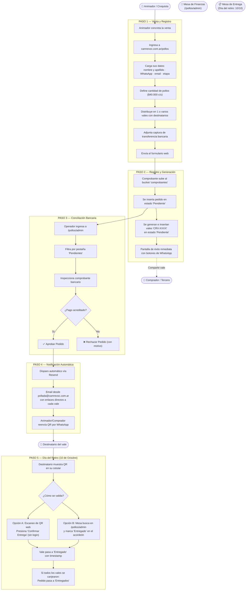

# Circuito y Flujo Operativo — Gran Pollada Solidaria

Este documento detalla el ciclo de vida completo de una venta en el módulo **Pollos**, desde el encargo inicial hasta el canje físico en la parrilla.

---

## 1. Diagrama del Circuito

---

## 2. Detalle de los Pasos Operativos

### Paso 1: Venta y Carga del Pedido
- El animador o crvquista vende los pollos. El pago se realiza por transferencia al alias `GRUPOSDBNQN` o en **efectivo en mano**.
- El animador entra a `/pollos`.
- Carga su nombre como responsable de la venta, su contacto, email y etapa para acreditar sus puntos en el ranking.
- Especifica la cantidad de pollos y la distribución en vales con los nombres de quienes retirarán.
- **Medio de Pago:**
  - **Transferencia (por defecto):** Realiza la transferencia al Santander y adjunta comprobante bancario.
  - **Efectivo:** Marca "¿Es pago en efectivo?", especifica obligatoriamente quién cobró el dinero en mano (`recibido_por`) y adjunta foto del recibo físico en papel.
- El comprobante es 100% obligatorio en ambos casos.

### Paso 2: Generación Inmediata de Vales
- El archivo se almacena en el bucket `comprobantes` de Supabase.
- Se ejecuta el Server Action `createOrder`:
  - Se registra el pedido en estado `Pendiente` (incluyendo `es_efectivo` y `recibido_por`).
  - Se generan los vales con códigos únicos `CRV-XXXX` en estado `Pendiente`.
- La pantalla muestra la confirmación inmediata con botones de WhatsApp preconfigurados para compartir cada vale al destinatario antes de que el pago sea revisado.

### Paso 3: Validación Administrativa (/pollos/admin)
- El equipo de finanzas inicia sesión con la contraseña maestra y selecciona su nombre de operador.
- En la pestaña **Pendientes**, revisa el comprobante y coteja con la cuenta bancaria (o con el cobrador indicado si fue en efectivo).
- **Indicador de Cobro:** Cada tarjeta/fila muestra visualmente `💵 Efectivo · Recibió: [nombre]` o `🏦 Transferencia`.
- **Edición Previa / Corrección:** El operador cuenta con el botón **Editar** para corregir la **etapa asignada a la venta** (pudiendo reasignar a la categoría especial `"Animadores"` o viceversa), el cobrador en mano o la modalidad de pago antes de aprobar, o utilizar el atajo **Guardar y Aprobar**.
- **Aprobación:** Al aprobar, el pedido cambia a `Aprobado`. Los vales quedan oficialmente habilitados para su canje.
- **Rechazo:** Si el comprobante es ilegible, no coincide el monto o el cobrador desconoce el pago, se rechaza indicando el motivo.

### Paso 4: Notificación por Email y WhatsApp
- Al aprobar, el sistema dispara automáticamente un correo electrónico transaccional vía Resend (`pollada@camrevoc.com.ar`) a la casilla informada en el pedido.
- El correo contiene los enlaces hacia `/pollos/vale/[codigo]`.
- El animador o comprador también puede compartir el enlace individual del vale por WhatsApp a cada destinatario.

### Paso 5: El Día del Retiro (10 de Octubre)
- El sábado **10 de octubre**, el destinatario se presenta en el puesto de entrega mostrando la pantalla del vale con el código QR.
- **Canje Autónomo por QR (Sin Login):** Cualquier persona puede abrir el enlace del vale desde su dispositivo y confirmar la entrega presionando el botón *"✅ CONFIRMAR ENTREGA DE POLLOS"* con confirmación en modal. Esto permite que los colaboradores de la parrilla entreguen sin necesitar claves de administración.
- **Canje desde el Panel:** Alternativamente, un operador en `/pollos/admin` puede buscar el pedido por nombre, vendedor o código y marcar el vale individual como entregado.
- Al canjearse todos los vales de un pedido, este cambia su estado visual a **Entregado** y se traslada a la pestaña correspondiente en el panel.

---

## 3. Discrepancias con Documentación Histórica

| Aspecto | Documentación Histórica / Previa | Realidad del Código Actual |
|---|---|---|
| **Momento de emisión de vales** | Se indicaba que los vales se generaban tras la aprobación administrativa. | Los vales se generan e insertan **al momento de crear el pedido** en estado `Pendiente`. |
| **Separación Comprador/Vendedor** | Se describían campos independientes para quién compra y quién vende. | El formulario unificó los datos en el vendedor responsable (`nombre_comprador` = `animador_vendedor`). |
| **Autenticación en la entrega** | Se especulaba si el canje requería cookies de administrador. | El canje web es **público y sin login**, operando el QR como autorización práctica deliberada. |
| **Fecha de retiro** | En algunas plantillas figuraba 11 de octubre de 2025. | La fecha definitiva fijada por decisión humana es el **10 de octubre**. |
